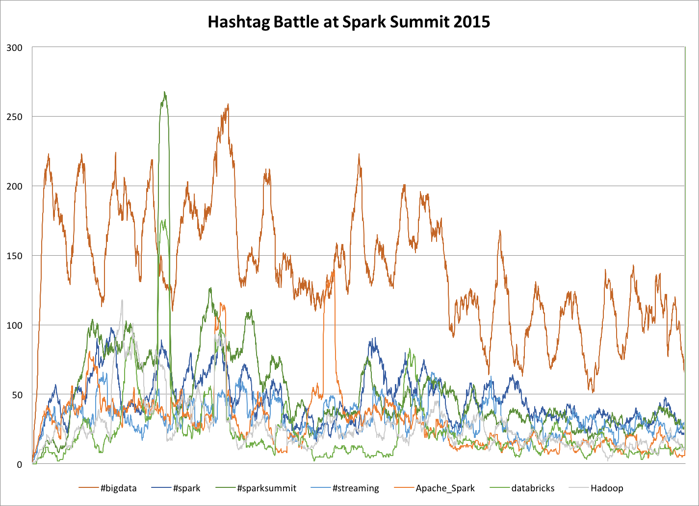

# Hashtag Battle with Spark Streaming

This is an example Spark streaming app that gives sliding window counts of hashtags and terms on Twitter. It has several available outputs that can be used concurrently: Kafka, socket, Graphite, local file, and stdout. We used this for an in-booth demo at the last Spark Summit, where we had it running on a cluster of four Odroid microcomputers with output to Graphite and then graphed with a Grafana dashboard. This usage guide should allow you to build from source and run the app, or run the pre built docker image of the app.

##Requirements

A Twitter app API key is **required** to run this demo. Go to https://apps.twitter.com/ to create a new app. Once you have created your app, go to the "Keys and Access Tokens" tab of your app and create an access token by clicking the "create my access token" button. Now copy these four values (consumer key/secret and access token/secret) into a file named `twitter4j.properties`. See the [template](twitter4j.properties.template) for formatting details. 

##Building from source

Build with (requires [sbt](http://www.scala-sbt.org/download.html)):

    sbt assembly

If you have spark installed you can then test it out with:

    spark-submit --master local[2] --class com.svds.hashtag.Battle \
      target/scala-2.10/hashtag-battle-assembly-1.0.jar \
      --hashtags love,twitter --output-stdout

Note that `--master local` (aka `local[1]`) will not work as the Twitter stream receiver will occupy the only task slot preventing any processing from happening.

##Docker

This is also available as a docker image at [svds/hashtag-battle](https://hub.docker.com/r/svds/hashtag-battle/). 
Note there is a [bug](https://github.com/docker/docker/issues/18180) with the version of boot2docker included with Docker 1.9.1 that can cause problems with this image, please use Docker 1.10.

    docker run -it -v $(pwd)/twitter4j.properties:/twitter4j.properties \
      svds/hashtag-battle --hashtags love,twitter --output-stdout

##Usage

    [ --hashtags list,of,hashtags ] [ --terms more,stuff ]
    [ --duration sec ] [ --window sec ] [ --partitions num ]
    [ --output-stdout ] [ --output-kafka brokers topic ] [ --output-socket host port ]
    [ --output-graphite host port path ] [ --output-file path ]

* Defaults
 - Duration is 5 sec, window is 10 min (600 sec), and number of partitions is 3.
* Notes
 - Multiple outputs can be specified, minimum one.
 - Hashtags and/or terms are required

When the app is first started (or restarted) all counts start at 0; it takes 10 minutes (or whatever your window is) to have a full moving window sum.

##Data from Spark Summit 2015

Also included in this GitHub repo is actual output from [Spark Summit 2015](https://spark-summit.org/2015/) day 1 in the file [hashtag-battle-spark-summit-2015.txt](hashtag-battle-spark-summit-2015.txt). Its format is `hashtag/term count timestamp` (with spaces in multi-word terms replaced with `_`). Below is a graph of a few of the hashtags and terms in this file.

